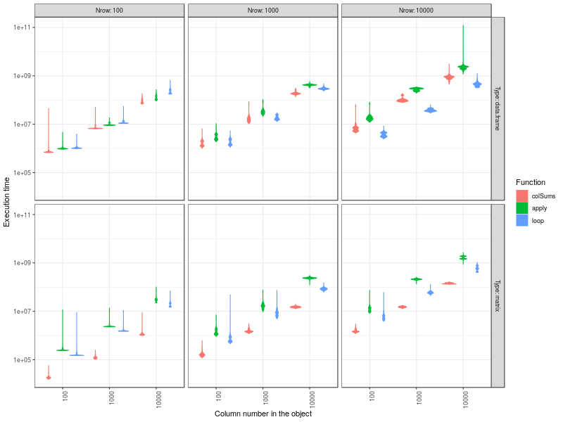

French below

# Execution time of some functions on data of different size

I recently started to develop tools for [galaxy-E](https://github.com/65MO/Galaxy-E) and I started to ask myself questions on the performance of some functions in R. After discussing with a colleague, I realised that I had never really tested the execution times of some functions that I often use, even thought I had an idea of the ranking that was the result of impressions and discussions with other R users.  
I performed these performance tests on 3 functions that sum columns and I made the number of columns and rows vary. Then, after a discussion with another colleague, I also made the type of object change (data.frame and matrix).  

Here are the functions I tested and the results:  

```
colSums(x)

apply(x, 2, sum)

colsums1Loop <- function(x){
  vect <- c()
  for (i in 1:ncol(x)){
    vect <- c(vect, sum(x[ ,i]))
  }
  return(vect)
}
colsums1Loop(x)

```


To conclude, the function I expected to be the fastest was most of the time the fastest (phew) but the relative differences between execution times depends on the object. All factors (number of rows, number of columns and object type) had an influence. If that is the case for these 3 functions, it's probably also the case for other functions.
The tests were performed with the package [microbenchmark](https://cran.r-project.org/web/packages/microbenchmark/index.html).

# Temps d'exécution de plusieurs fonctions sur des données de différentes tailles

Je développe depuis peu des outils pour [galaxy-E](https://github.com/65MO/Galaxy-E) et cela m'ammène à me poser des questions sur l'efficacité de certaines fonctions dans R. Au gré d'une discussion avec Yvan Le Bras, je me suis rendu compte que je n'avais jamais trop testé les temps d'exécution de certaines fonctions que j'utilise souvent, même si dans ma tête j'avais mon petit classement qui venait d'impressions et de discussions avec d'autres utilisateurs.  
J'ai donc fait des tests d'efficacité sur un outil tout bête permettant de faire des sommes de colonnes et j'ai regardé l'effet de la taille de mon objet et de sa structure (ici le nombre de colonnes et de lignes de l'objet). Puis après en avoir discuté avec Alain Danet, j'ai ajouté le type d'objet (data.frame et matrix) comme facteur à tester.
Voici les fonctions que j'ai testées et les résultats :

```
colSums(x)

apply(x, 2, sum)

colsums1Loop <- function(x){
  vect <- c()
  for (i in 1:ncol(x)){
    vect <- c(vect, sum(x[ ,i]))
  }
  return(vect)
}
colsums1Loop(x)

```


La conclusion c'est que la fonction que je pensais la plus rapide est presque toujours la plus rapide (ouf) mais les écarts de vitesse d'exécution sont très dépendant de l'objet. Tous les facteurs (nombre de lignes, nombre de colonnes et type d'objet) ont une influence. Si c'est le cas pour ces trois fonctions, il est probable que ce soit égalment le cas pour d'autres fonctions.  
A l'heure où l'on se pose beaucoup de question sur les ressources de calcul disponibles, je pense qu'il y a également de la place pour ce poser des question sur l'efficacité de nos scripts.
J'ai réalisé les tests avec le package [microbenchmark](https://cran.r-project.org/web/packages/microbenchmark/index.html). Il est probable que mon scrit ne soit pas le plus efficace ;-) mais il est disponible ici.
