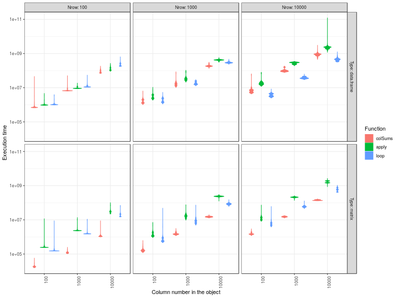

# Temps d'exécution de plusieurs fonctions sur des données de différentes tailles

Je dois depuis peu développer des outils pour [galaxy-E](https://github.com/65MO/Galaxy-E) et cela m'ammène à me poser des questions sur l'efficacité de certaines fonctions dans R. Au gré d'une discussion avec un Yvan Le Bras, je me suis rendu compte que je n'avais jamais trop testé les temps d'exécution de certaines fonctions que j'utilise souvent, même si dans ma tête j'avais mon petit classement qui venait d'impressions et de discussions avec d'autres utilisateurs.  
J'ai donc fait des tests d'efficacité sur un outil tout bête permettant de faire des sommes de colonnes et j'ai regardé l'effet de la taille de mon objet et de sa structure (ici le nombre de colonnes et de lignes de l'objet). Puis après en avoir discuté avec Alain Danet, j'ai ajouté le type d'objet (data.frame et matrix) comme facteur à tester.

La conclusion c'est que la fonction que je pensais la plus rapide est presque toujours la plus rapide (ouf) mais les écarts de vitesse d'exécution sont très dépendant de l'objet. Tous les facteurs (nombre de lignes, nombre de colonnes et type d'objet) ont une influence. Si c'est le cas pour ces trois fonctions, il est probable que ce soit égalment le cas pour d'autres fonctions.  
A l'heure où l'on se pose beaucoup de question sur les ressources de calcul disponibles, je pense qu'il y a également de la place pour ce poser des question sur l'efficacité de nos scripts.
J'ai réalisé les tests avec le package [microbenshmark](https://cran.r-project.org/web/packages/microbenchmark/index.html). Il est probable que mon scrit ne soit pas le plus efficace ;-) mais il est disponible ici.
